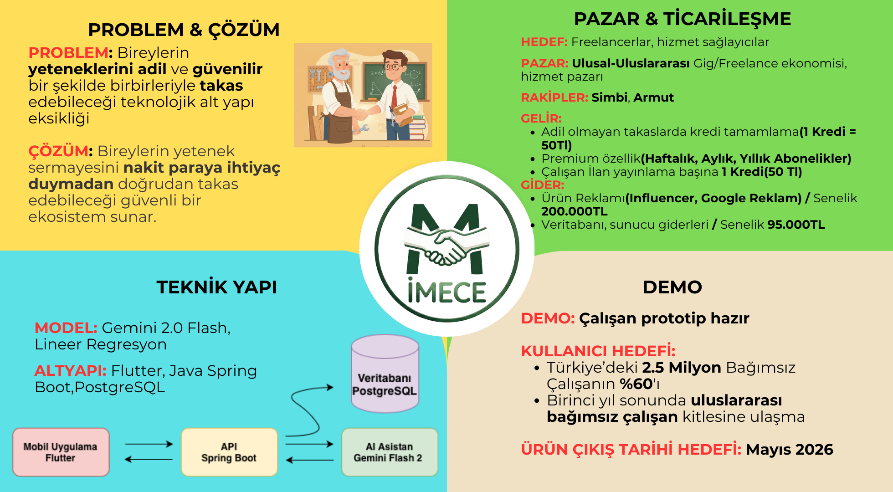
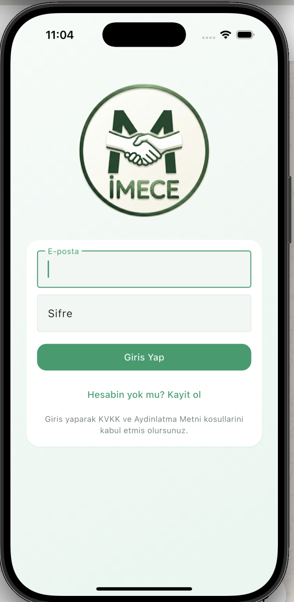
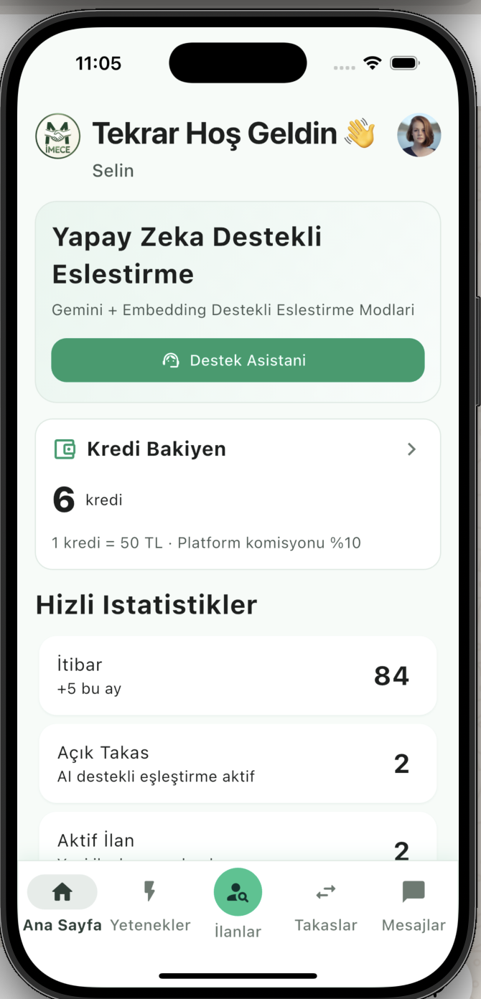
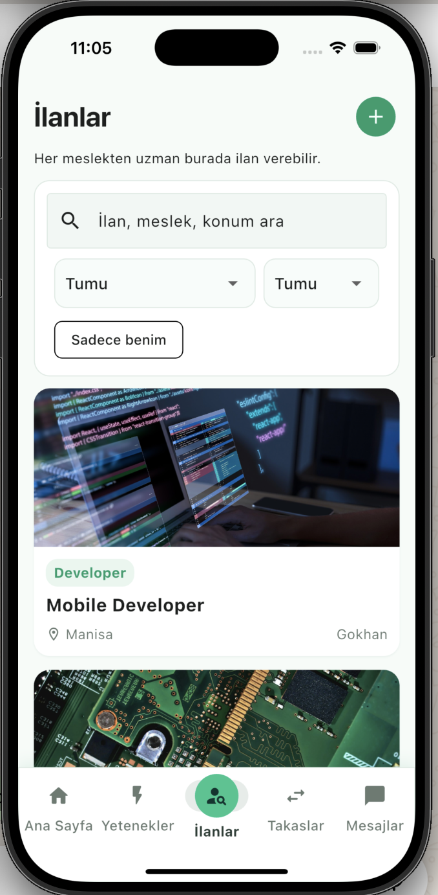
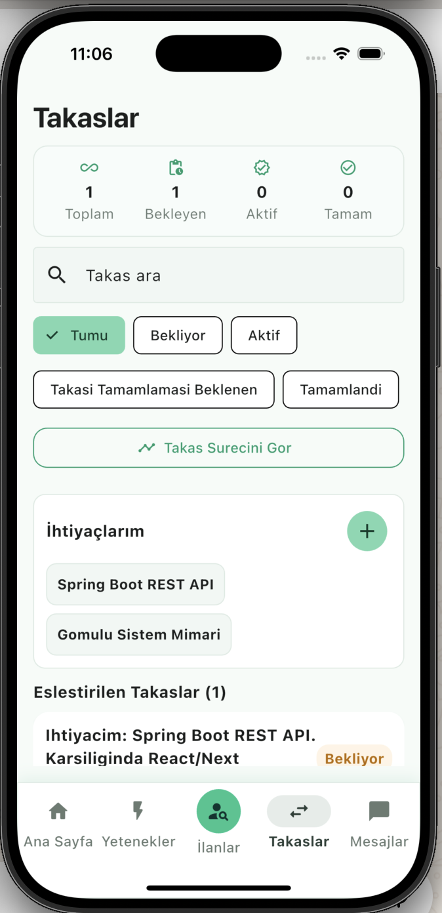
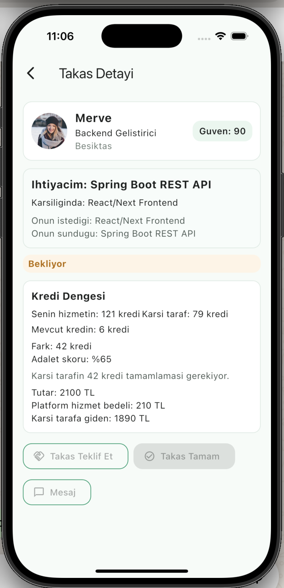

# İMECE · Yetenek Takası Demo

Güven, kredi dengesi ve adalet skoruna odaklanan iki taraflı takas / hizmet pazarını gösteren uçtan uca demo. Spring Boot backend + Flutter mobil istemci + basit ML regresyon modeliyle gelir.



## Özellikler (kısaca)
- Karşılıklı ihtiyaç/teklif tabanlı eşleştirme, boost’lu profil önceliği
- Kredi değeri (regresyon / kural tabanı) ve adalet skoru ile takas dengeleme
- Kredi cüzdanı, işlem geçmişi, kredi tamamlama ve platform komisyonu
- Güven skoru: tamamlanan iş, yorum ve profil doluluğuna göre dinamik
- Mesajlaşma, takas süreci yönetimi (teklif → kabul → tamamla → yorumla)
- Opsiyonel Gemini entegrasyonu: metinden want/offer çıkarımı

## Ekran Görselleri
| Ana | Destek Asistanı | Takaslar | Kredi | İlanlar |
| --- | --- | --- | --- | --- |
|  |  |  |  |  |

## Mimari
- **Mobil (Flutter)**: `mobile/` — Swaps, Listings, Chat, Credits modülleri.
- **Backend (Spring Boot)**: `backend/` — REST API, kredi/adalet hesapları, güven skoru, mesajlaşma.
- **ML**: `ml/train_credit_regression.py` — CSV’den regresyon katsayılarını üretip `data/credit_regression_model.sql` olarak kaydeder.
- **Veri**: `data/` — eğitim CSV, tohum SQL’ler (`credit_profiles_seed.sql`, `credit_regression_model.sql`).

### Veri modelleri (özet)
- `users`: profil, güven skoru, boost, foto.
- `user_skills`: `OFFER` / `WANT` skill’ler.
- `swap_requests`: kullanıcı ihtiyaç/teklif kayıtları (`OPEN`, `LOCKED`, `DONE`).
- `swap_matches`: karşılıklı eşleşmeler; kredi farkı `accept` sonrası hesaplanır, `DONE` sonrası yorumlar.
- `credit_wallets`, `credit_transactions`: bakiye ve hareketler.
- `swap_reviews`: yıldız + yorum, güven güncellemesi tetikler.

## Kurulum
### Backend
```bash
cd backend
./mvnw spring-boot:run
```
`backend/src/main/resources/application.properties` içinde DB ve opsiyonel `GEMINI_API_KEY` ayarlarını yapın.

### Mobil
```bash
cd mobile
flutter pub get
flutter run
```

### ML (opsiyonel)
```bash
python3 ml/train_credit_regression.py --csv data/synthetic_training_data_520.csv --out-dir data
```
Çıktı: `data/credit_regression_model.sql` (katsayılar), `data/credit_profiles_seed.sql` (kategori profilleri).

### Demo için hızlı seed
1. PostgreSQL’de veritabanını oluşturun: `CREATE DATABASE hackathon;`
2. İsteğe bağlı tohum/seed için:  
   - `psql -d hackathon -f data/credit_profiles_seed.sql`  
   - `psql -d hackathon -f data/credit_regression_model.sql`
3. Uygulama ayarında demo seed açmak için:  
   - `app.seed.enabled=true`

## Kullanım Akışı (demo rehberi)
1. **İhtiyaç ekle** (+ dialog): `swap_requests`’a kayıt düşer, `swap_matches` rebuild ile eşleşme görünür.
2. **Eşleştirilen kart**: Adalet skoru, kredi farkı, “Takas Tamam” ve mesaj butonu.
3. **Kredi Tamamlama**: Kredi yetersizse detayda satın alma; platform komisyonu otomatik hesaplanır.
4. **İşlem Sonu**: Çift taraf “Takas Tamam” → `DONE`; yorum ve yıldız → güven skoru güncellenir.
5. **Timeline**: “Takas Süreci” ekranında “Tamamlanmış” filtresi; sağdan sola kaydırarak DONE kayıtlarını silebilirsin.

## API
Tam liste ve örnekler: `docs/api_contract.md`  
Kısa sağlık kontrolü: `GET /health`

## Proje Yapısı
- `backend/` Spring Boot API
- `mobile/` Flutter app
- `ml/` Eğitim scriptleri
- `data/` Eğitim ve seed SQL
- `docs/` API kontratı
- `assets/` Logo, tanıtım kartı, ekran görselleri

## İletişim / Lisans
Demo amaçlıdır; lisans eklenmedi. Sorular için proje issue’larını kullanın.
